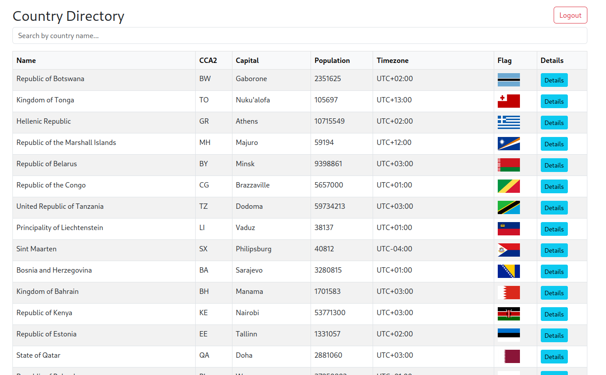
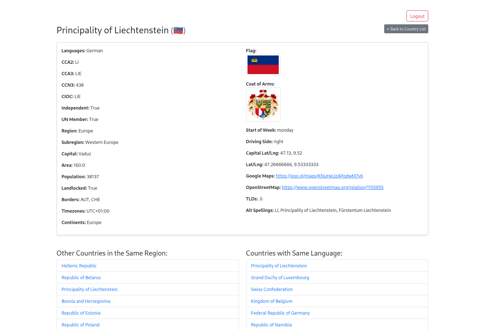

# Country Info Django Application

A Django web application that displays detailed country information retrieved via authenticated API endpoints. Only logged-in users can access the data.

---
## Features

- User authentication (login/logout)
- Country list and detail views
- Secure session-based API access
- Search by country name

## Setup Instructions

### 1. Clone the Repository
```bash
git clone https://github.com/noshinfaria/Country-Info.git
cd Country-Info
```
### 2. Create and Activate a Virtual Environment
```bash
python -m venv venv
source venv/bin/activate        # On Windows: venv\Scripts\activate
```
### 3. Install Requirements
```bash
pip install -r requirements.txt
```
### 4. Apply migrations to set up the database:
```bash
python manage.py migrate
```
### 5. Create a superuser (optional, for admin access)
```bash
python manage.py createsuperuser
```
### 6. Run the development server:
```bash
python manage.py runserver
```

## API Endpoints
### 1. List All Countries
- **URL**: `/api/countries/`
- **Method**: `GET`
- **Description**: Fetch a list of all countries.
- **Response Example**:
  ```json
  [
    {
      "id": 1,
      "name_common": "United States",
      "capital": "Washington, D.C.",
      "region": "Americas",
      "population": 331000000
    },
    ...
  ]
### 2. Retrieve Specific Country by ID

- **URL**: `/api/countries/<int:id>/`
- **Method**: `GET`
- **Description**: Fetch details of a specific country by its ID.
- **URL Params**:
  - `id`: The unique identifier of the country.

- **Example URL**: `/api/countries/1/`

- **Response Example**:
  ```json
  {
    "id": 1,
    "name_common": "United States",
    "capital": "Washington, D.C.",
    "region": "Americas",
    "population": 331000000
  }
### 3. Create a New Country Entry

- **URL**: `/api/countries/`
- **Method**: `POST`
- **Description**: Create a new country entry in the database.
- **Request Body** (JSON):
  ```json
  {
    "name_common": "Japan",
    "name_official": "Japan",
    "capital": "Tokyo",
    "region": "Asia",
    "population": 126300000   
  }
- **Response Example**:
  ```json
    {
        "id": 251,
        "name_common": "Japan",
        "name_official": "Japan",
        "capital": "Tokyo",
        "region": "Asia",
        "subregion": null,
        "population": 126300000,
        "area": null,
        "flag_url": null
    }
### 4. Update an Existing Country

- **URL**: `/api/countries/<int:id>/`
- **Method**: `PUT or PATCH`
- **Description**: Update the details of an existing country entry by its ID.
- **Partial Update Request Body (PATCH)**:
  ```json
    {
    "capital": "New Tokyo"
    }


- **Response Example**:
  ```json
    {
        "id": 251,
        "name_common": "Japan",
        "name_official": "State of Japan",
        "capital": "New Tokyo",
        "region": "Asia",
        "subregion": null,
        "population": 126300000,
        "area": null,
        "flag_url": null
    }
### 5. Delete an Existing Country

- **URL**: `/api/countries/<int:id>/delete/`
- **Method**: `DELETE`
- **Description**: Delete an existing country by its ID.
- **URL Params**:
    - `id`: The unique identifier of the country.
- **Example URL**:  `/api/countries/1/delete/` (Deletes the country with ID = 1)
- **Response Example**:
  ```json
    {
    "detail": "Country deleted successfully."
    }
### 6. List same regional countries of a specific country.

- **URL**: `/api/countries/<int:id>/same-region/`
- **Method**: `GET`
- **Description**: Fetch all countries that are in the same region as the country with the specified ID.
- **URL Params**:
    - `id`: The unique identifier of the country.
- **Example URL**:  `/api/countries/2/same-region/`
- **Response Example**:
  ```json
    
  {
    "id": 2,
    "name_common": "Canada",
    "capital": "Ottawa",
    "region": "Americas",
    "population": 37000000
  },
  {
    "id": 3,
    "name_common": "Mexico",
    "capital": "Mexico City",
    "region": "Americas",
    "population": 126000000
  }
### 7. List countries that speak the same language based on a given language.

- **URL**: `/api/countries/language/`
- **Method**: `GET`
- **Description**: Fetch all countries that speak the same language based on a given language.
- **Example URL**:  `/api/countries/language/?q=united`
- **Response Example**:
  ```json
    
  {
    "id": 1,
    "name_common": "United States",
    "capital": "Washington, D.C.",
    "region": "Americas",
    "languages": "English",
    "population": 331000000
  },
  {
    "id": 2,
    "name_common": "United Kingdom",
    "capital": "London",
    "region": "Europe",
    "languages": "English",
    "population": 67000000
  }
### 8. Search for a country by its name (supports partial search)

- **URL**: `/api/countries/search/`
- **Method**: `GET`
- **Description**: Search for countries by name (supports partial search).
- **Example URL**:  `/api/countries/search/?q=united`
- **Response Example**:
  ```json
  {
    "id": 1,
    "name_official": "United States",
    "capital": "Washington, D.C.",
    "region": "Americas",
    "languages": "English, Spanish",
    "population": 331000000
  },
  {
    "id": 2,
    "name_official": "United Kingdom",
    "capital": "London",
    "region": "Europe",
    "languages": "English",
    "population": 67000000
  }

## Web Interface
### 1. List All Countries
- **URL**: `/countries/`
- **Method**: `GET`
- **Description**: Fetch a list of all countries with a detail button. A search button for partially search the country name.



---

### 2. Detail Page of A Country

- **URL**: `/countries/<int:id>/`
- **Method**: `GET`
- **Description**: Fetch details of a specific country by its ID. Fetch countries list having similar region and language.


